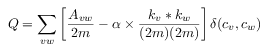

# extended-modularity

Python code of my master's thesis "New clustering proposals for Twitter based on the Louvain algorithm". http://jordic.com/pfm.pdf

It is a generalization of the measure https://en.wikipedia.org/wiki/Modularity_(networks) which introduces the parameter alpha that allows controlling the granularity of the solution found by clustering algorithm. It is computed with the following equation.

In this image we can see the effects of changing the value of alpha.

